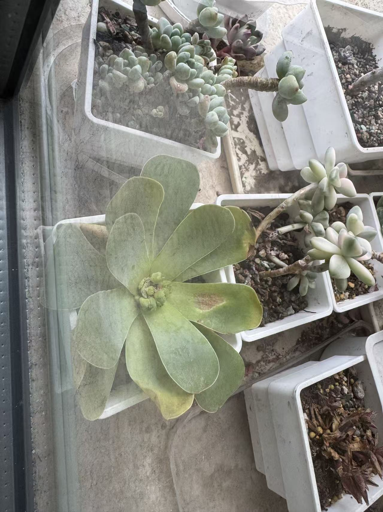
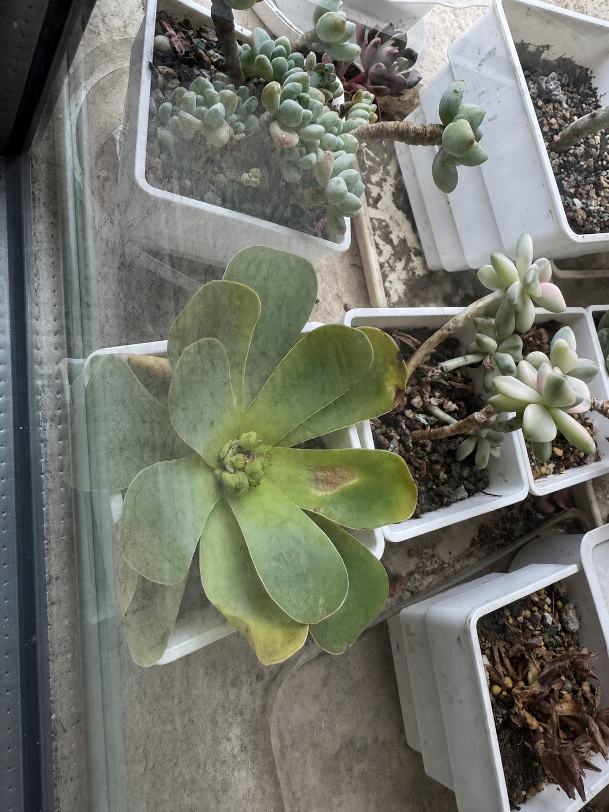
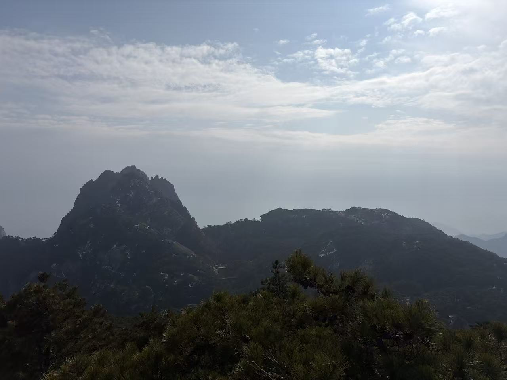

# 技能修图

一个给 Codex / Skill 场景使用的修图技能。

它不是单纯“润色一段提示词”，而是先看图、判断题材、匹配更合理的摄影参数，再生成适合当前场景的中文增强 / 重建提示词；如果图片是人像，还会额外切到“严格保身份”分支。

---

## 1. Skill 简介

这个 skill 主要解决三个实际问题：

1. 给参考图时，不想每次都手写一大段摄影分析和修图提示词。
2. 同一套修图话术并不适合所有图片，人像、风景、街拍、夜景、静物需要不同分支。
3. 人像场景下，很多生成式编辑容易把人修成“像但不是同一个人”，所以需要更强的身份约束。

它的核心流程是：

1. 先识别图片属于什么拍摄题材
2. 再匹配镜头、光圈、快门、ISO 的建议
3. 最后输出一段高约束中文提示词
4. 如果是人像，再附加“保身份、保表情、保脸型、保背景”的限制

---

## 2. 能做什么

### 场景识别

支持把参考图判断为这些常见题材：

- 晴天室外人像
- 阴天人像
- 傍晚日落人像
- 室内窗边人像
- 夜景人像手持
- 风景白天
- 日出日落风景
- 夜景建筑 / 车轨
- 街拍 / 纪实
- 美食 / 静物
- 多人合影
- 小孩 / 宠物
- 运动 / 比赛

### 参数建议

会根据识别出的题材输出更贴近摄影常识的参数建议：

- 镜头
- 光圈
- 快门
- ISO
- 为什么这样选

### 提示词生成

输出中文重建 / 增强提示词，分两类模板：

- 人像模板：强调身份、表情、脸型、背景连续性
- 非人像模板：强调场景、构图、光线、主体关系不变

---

## 3. 这个 Skill 的特别之处

和很多“直接给图就生成一段提示词”的做法相比，这个 skill 多了一层“摄影场景路由”：

- 它不会默认所有图都套同一种修图逻辑
- 它会先判断题材，再选参数，再生成提示词
- 它把人像和非人像彻底分开处理

对人像场景，它支持一个固定重建模式：

- 85mm
- f/1.4
- +1.6 EV 的提亮观感
- ISO 100
- 1/200 快门

这个模式适合在“强约束重建人像氛围”时使用，而不是强行套到所有图片上。

---

## 4. 效果展示

### 示例 1：植物静物增强

原图



增强结果



这个案例走的是“美食 / 静物 / 植物近摄”分支，重点保留：

- 原花盆布局
- 玻璃反光和窗边柔光质感
- 植物叶片朝向与位置关系

主要增强方向是：

- 提高清晰度和微对比
- 改善雾感
- 优化植物叶片层次和色彩纯净度

### 示例 2：山景风景增强

原图



增强结果


这个案例走的是“风景白天”分支，重点保留：

- 山峰和山脊轮廓
- 前景松树
- 天空和云层结构
- 远山层次关系

主要增强方向是：

- 提亮整体曝光
- 恢复暗部细节
- 增强云层层次和天空通透感
- 提升空气透视和山体分离感

---

## 5. 目录结构

```text
skill-retouch/
├── README.md
├── assets/
│   └── showcase/
│       ├── plant-original.jpg
│       ├── plant-enhanced.png
│       ├── mountain-original.jpg
│       └── mountain-enhanced.png
└── skill/
    ├── SKILL.md
    ├── agents/
    │   └── openai.yaml
    └── references/
        ├── prompt-template.md
        ├── non-portrait-template.md
        └── scene-parameters.md
```

---

## 6. 使用方式

最稳的触发方式是显式调用：

```text
用 $portrait-identity-85mm 分析这张图，并生成中文重建提示词
```

我也额外把触发语义补成了更自然的中文，所以像下面这些说法也更容易命中：

```text
技能修图，帮我增强这张图
技能修图，看看这张图适合什么镜头和参数
技能修图，如果是人像就保身份，不是人像就按场景修
```

---

## 7. 适合什么人

- 想把“看图分析 + 修图提示词”标准化的人
- 经常做参考图重建、场景重建、图像增强的人
- 既关心摄影语言，也关心生成式编辑约束的人
- 想让 AI 在人像修图时尽量别“换脸”的人

---

## 8. 我这次是怎么做出来的

这个 skill 不是一次成型的，而是边用边补出来的：

1. 先从单一的人像保身份需求出发
2. 发现只适合人像，不适合风景、静物、街拍
3. 再把摄影参数经验拆成多个场景分支
4. 最后把“题材识别 -> 参数匹配 -> 提示词生成”串起来

所以现在它既能处理人像，也能处理非人像。

---

## 9. 已知边界

- 它更擅长“增强 / 重建提示词生成”，不是替代专业修图软件
- 如果原图分辨率极低、主体严重遮挡，结果会受限
- 人像的“严格保身份”是高约束目标，但生成式编辑本身仍有偏差风险
- 不同模型对“背景完全不动”的遵守程度不同

---

## 10. 后续可以继续补什么

- 增加微距植物、产品棚拍、建筑 interior 等更细分模板
- 增加英文提示词输出
- 增加 ComfyUI / InstantID / InfiniteYou 工作流适配说明
- 增加更多调用示例和失败案例

---

## 11. 仓库说明

这个仓库当前公开的是 skill 本体、参考模板和效果展示，方便直接查看、复用和继续迭代。

如果你想拿去自己用，建议直接从 `skill/` 目录开始看：

- `SKILL.md`：主流程
- `references/scene-parameters.md`：场景与参数速查
- `references/prompt-template.md`：人像高约束模板
- `references/non-portrait-template.md`：非人像模板
